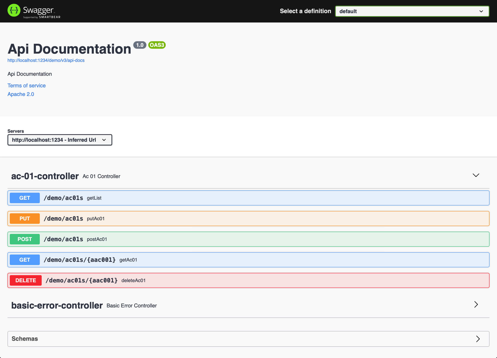
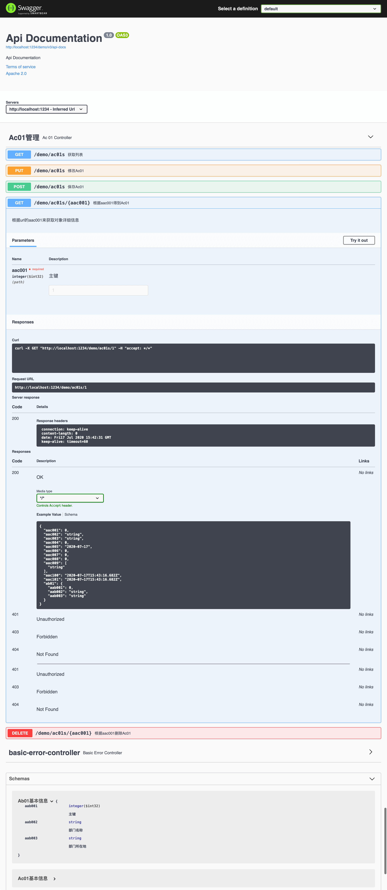

# spring-boot-swagger2

> restfull 使用springfox3生成swagger文档

[TOC]

## 加入依赖
```xml
    <dependencies>
        <dependency>
            <groupId>io.springfox</groupId>
            <artifactId>springfox-boot-starter</artifactId>
            <version>3.0.0</version>
        </dependency>
    </dependencies>
```

## [App.java](src/main/java/com/example/lewjun/App.java)增加注解@EnableOpenApi

```java
/**
 * spring boot 启动类
 */
@EnableOpenApi
@SpringBootApplication
public class App {
    public static void main(String[] args) {
        SpringApplication.run(App.class, args);
    }
}
```

## 访问swagger-ui/index.html
通过如上两步就可以访问http://localhost:1234/demo/swagger0ui/index.html

如图，全都是英文。

## 配置
* 模型类
    * @ApiModel
    * @ApiModelProperty

* 控制器
    * @Api
    * @ApiOperation
    * @ApiImplicitParam

### [Ab01.java](src/main/java/com/example/lewjun/domain/Ab01.java)
```java
@ApiModel("Ab01基本信息")
@Data
@Accessors(chain = true)
public class Ab01 extends BaseObj {
    @ApiModelProperty("主键")
    private int aab001;
    @ApiModelProperty("部门名称")
    private String aab002;
    @ApiModelProperty("部门所在地")
    private String aab003;
}
```

### [Ac01Controller.java](src/main/java/com/example/lewjun/web/Ac01Controller.java)
```java
@Api(tags = "Ac01管理")
@RequestMapping("/ac01s")
@RestController
public class Ac01Controller {

    @Autowired
    private Ac01Service ac01Service;

    /**
     * 获取列表
     *
     * @return List<Ac01>
     */
    @ApiOperation("获取列表")
    @GetMapping
    public List<Ac01> getList() {
        return ac01Service.getList();
    }

    /**
     * 保存Ac01
     *
     * @param ac01 Ac01
     * @return Ac01
     */
    @ApiOperation("保存Ac01")
    @PostMapping
    public Ac01 postAc01(@RequestBody final Ac01 ac01) {
        ac01Service.save(ac01);
        return ac01;
    }

    /**
     * 根据aac001得到Ac01
     *
     * @param aac001 aac001
     * @return Ac01
     */
    @ApiOperation(value = "根据aac001得到Ac01", notes = "根据url的aac001来获取对象详细信息")
    @ApiImplicitParam(paramType = "path", dataType = "int", name = "aac001", value = "主键", required = true, example = "1")
    @GetMapping("/{aac001}")
    public Ac01 getAc01(@PathVariable final int aac001) {
        return ac01Service.get(aac001);
    }
}
```

此时的访问就方便阅读了。


## Try it out
点击右上角的Try it out 还可以做测试。

## [application.yml](src/main/resources/application.yml)

```yaml
server:
  port: 1234
  servlet:
    context-path: /demo
```

## Try it

* MacOS/Linux
    * ./mvnw spring-boot:run

* Windows
    * mvnw spring-boot:run

## package

mvn clean package -Dmaven.test.skip=true

## run jar

java -jar xxx.jar

## postman文件

[spring-boot-restfull.postman_collection.json](doc/spring-boot-restfull.postman_collection.json)