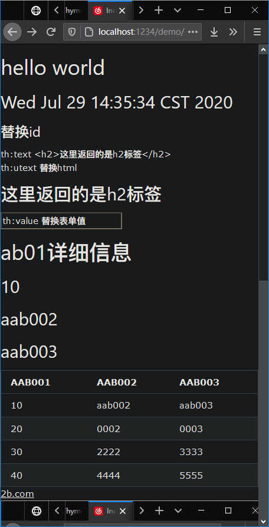
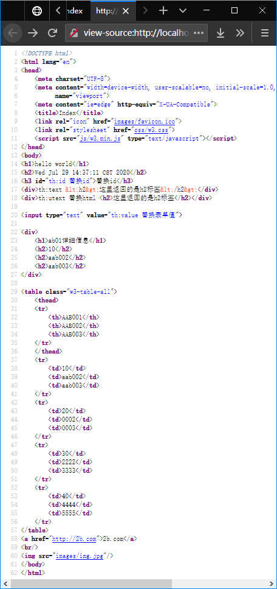

# spring-boot-template-thymeleaf

> 一个spring boot的thymeleaf例子

[TOC]

## 添加依赖

```xml
        <dependency>
            <groupId>org.springframework.boot</groupId>
            <artifactId>spring-boot-starter-thymeleaf</artifactId>
        </dependency>
```

## 建立templates目录
在src/main/resources下建立templates目录，用于存放模板文件，例如index.html

## [App.java](src/main/java/com/example/lewjun/App.java)
```java
/**
 * spring boot 启动类
 */
@SpringBootApplication
@Controller
public class App {
    public static void main(final String[] args) {
        SpringApplication.run(App.class, args);
    }

    @GetMapping("/")
    public String index(final Model model) {
        model.addAttribute("msg", "hello world");
        model.addAttribute("now", new Date());
        return "index";
    }
}
```

## th标签的使用

### [App.java](src/main/java/com/example/lewjun/App.java)

```java
@SpringBootApplication
@Controller
public class App {
    public static void main(final String[] args) {
        SpringApplication.run(App.class, args);
    }

    @GetMapping("/")
    public String index(final Model model) {
        model.addAttribute("msg", "hello world");
        model.addAttribute("now", new Date());

        model.addAttribute("th_id", "th:id 替换id");
        model.addAttribute("th_text", "th:text <h2>这里返回的是h2标签</h2>");
        model.addAttribute("th_utext", "th:utext 替换html <h2>这里返回的是h2标签</h2>"); // <p th:utext="html content">default content</p>
        model.addAttribute("th_value", "th:value 替换表单值"); // <input th:value="${xxx}" />
        model.addAttribute("th_each", "thEach 迭代"); // <tr th:each="ab01:${ab01s}"></tr>
        model.addAttribute("th_src", "images/img.jpg"); //
        model.addAttribute("th_href", "http://2b.com"); //
//        model.addAttribute("th:src", "thSrc 替换资源"); //

        model.addAttribute("ab01", new Ab01(10, "aab002", "aab003"));

        model.addAttribute("ab01sHeaders", Arrays.asList("AAB001", "AAB002", "AAB003"));
        model.addAttribute("ab01s", Arrays.asList(
                new Ab01(10, "aab002", "aab003"),
                new Ab01(20, "0002", "0003"),
                new Ab01(30, "2222", "3333"),
                new Ab01(40, "4444", "5555")
        ));

        return "index";
    }
}
```

### [index.html](src/main/resources/templates/index.html)

```html
<!DOCTYPE html>
<html lang="en" xmlns:th="http://www.thymeleaf.org">
<head>
    <meta charset="UTF-8">
    <meta content="width=device-width, user-scalable=no, initial-scale=1.0, maximum-scale=1.0, minimum-scale=1.0"
          name="viewport">
    <meta content="ie=edge" http-equiv="X-UA-Compatible">
    <title>Index</title>
    <link rel="icon" th:href="@{images/favicon.ico}">
    <link rel="stylesheet" th:href="@{css/w3.css}">
    <script th:src="@{js/w3.min.js}" type="text/javascript"></script>
</head>
<body>
<h1 th:text="${msg}">hello</h1>
<h2 th:text="${now}">2020-07-29</h2>
<h3 th:id="${th_id}">替换id</h3>
<div th:text="${th_text}">default div content1</div>
<div th:utext="${th_utext}">
    default div content
</div>

<input th:value="${th_value}" type="text" value="default input value">

<div>
    <h1>ab01详细信息</h1>
    <h2 th:text="${ab01.aab001}"></h2>
    <h2 th:text="${ab01.aab002}"></h2>
    <h2 th:text="${ab01.aab003}"></h2>
</div>

<table class="w3-table-all">
    <thead>
    <tr>
        <th th:each="ab01sHeader:${ab01sHeaders}" th:text="${ab01sHeader}"></th>
    </tr>
    </thead>
    <tr th:each="ab01:${ab01s}">
        <td th:text="${ab01.aab001}"></td>
        <td th:text="${ab01.aab002}"></td>
        <td th:text="${ab01.aab003}"></td>
    </tr>
</table>
<a th:href="${th_href}">2b.com</a>
<br/>

</body>
</html>
```

### 最终呈现

* 页面展示效果



* html源码




## Try it

* MacOS/Linux
    * ./mvnw spring-boot:run

* Windows
    * mvnw spring-boot:run

## package

mvn clean package -Dmaven.test.skip=true

## run jar

java -jar xxx.jar

